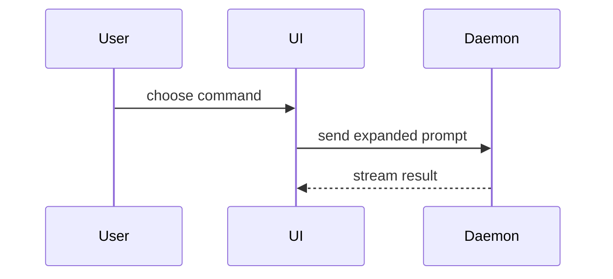

<!-- markdownlint-disable MD013 -->
<!-- Preserve upstream example and paragraph layout. -->

# PR Description

This is a writing aid, not a PR workflow. Draft or improve the body; the
calling workflow still owns existing review and publication gates, CI, Codex
feedback, and merge decisions. This skill does not run Git/GitHub mutations
or add a new gate.

Prefer the repository's required PR template when one exists; fit the sections
below into it rather than replacing required fields. Include the relevant
Seeds issue/plan reference when known; do not invent one.

Use this template for writing the PR body:

```markdown
## Summary

<brief prose; optional diagram, diff-sketch, or tree>

## Evidence

- **Before:** <screenshot/output/failing test run>
  **After:** <screenshot/output/passing test run>

## Merge Danger

**Door:** <one-way or two-way>

<optional: description>

**Blast Radius:** <brief scope description>

<optional: potential ramifications of merge>
```

## Sections

Skip all preambles and keep prose brief. Use the user's domain language from
`GLOSSARY.md` when it exists in the target repository; otherwise use the
language of the request and surrounding code. Do not create a glossary for a PR.

### Summary

Pick the smallest view that makes the key point clear. Plain prose is
sufficient; visuals are optional, not a requirement.

- Show logic or an algorithm as pseudocode:

```text
on(save)
  if content is unchanged
    return cached result
  write new content
  return fresh result
```

- Show runtime control flow as a call tree:

```text
submitForm
  createSession
    persistPrompt
    launchAgent
  navigateToSession
```

- Show UI structure as a component tree, including state and module boundaries that matter:

```text
<SessionPage> (apps/example/src/routes/session.tsx)
  useSessionEvents()
  <SessionToolbar>
    <RunSkillButton> (packages/ui)
```

- Show file responsibility or a broad refactor as a shallow file tree:

```text
src/
├── commands/       # parses user actions
├── sessions/       # owns session state
└── transport/      # sends API requests
```

- Show component interaction, control flow, or data flow with Mermaid:



- Use `diff` when the point is what changes and the surrounding shape already exists. Match the diff shape to the topic.

For a component change:

```diff
 <SessionPage>
   useSessionEvents()
   <SessionToolbar>
+    <RunSkillButton />
   <SessionTimeline>
+    <SkillResultCard />
```

For a file-layout change:

```diff
 src/
 ├── commands/
+│   └── show-me.ts       # expands the slash command
 ├── sessions/
-└── transport.ts
+└── transport/
+    ├── client.ts
+    └── stream.ts
```

For a call-tree or call-stack change:

```diff
 submitForm
   createSession
     persistPrompt
+    expandSkillMention
     launchAgent
-  navigateToSession
+  navigateToSession
+    subscribeToEvents
```

For a state or control-flow change:

```diff
 on(save)
-  write content
+  if content is unchanged
+    return cached result
+  write new content
+  invalidate cache
```

- Show the whole block when most of it is new, when omitted context would hide ownership or order, or when the user needs a copyable target shape:

```ts
function expandSkill(command: string): string {
  const skillName = command.slice(1);
  return `use the ${skillName} skill`;
}
```

#### Guidance

Place each visual next to the short text it supports. Keep only the calls, files, props, states, and boundaries needed to answer the user's current question or the options to resolve the current discussion point.

You may use one of these, you may use several, it is unlikely you will use all of them. Use your judgement and don't overwhelm the user.

### Evidence

Concrete evidence that the change works. Show before/after when available.
Never invent runs, results, screenshots, or a failing baseline. If before
was not measured, say **Before: not measured** and give the observed after
result. If a check was not run, say so and why. Keep local validation, CI,
review, and merge state distinct; an opened PR is not a reviewed or merged PR.

Screenshots are useful when the environment is set up and the change is visual.
Execution-based evidence includes exact commands, tests, exit status, and
observed results. Keep pseudocode in Summary, not as a substitute for run evidence.
Redact secrets, personal data, and internal-only details before putting evidence
in a PR body; report only information appropriate for that repository's audience.

### Merge Danger

Describe whether it's a one-way or two-way door. You can walk back through two-way doors, but not one-way doors. A PR that is cheap to roll back is lower risk. Changes that involve destructive actions or hard-to-reverse decisions are one-way doors.

The blast radius is the potential impact or scope of the changes introduced by this PR. Consider all possibilities. Examples are layout shift, breakages for consumers, mobile responsiveness, etc.
